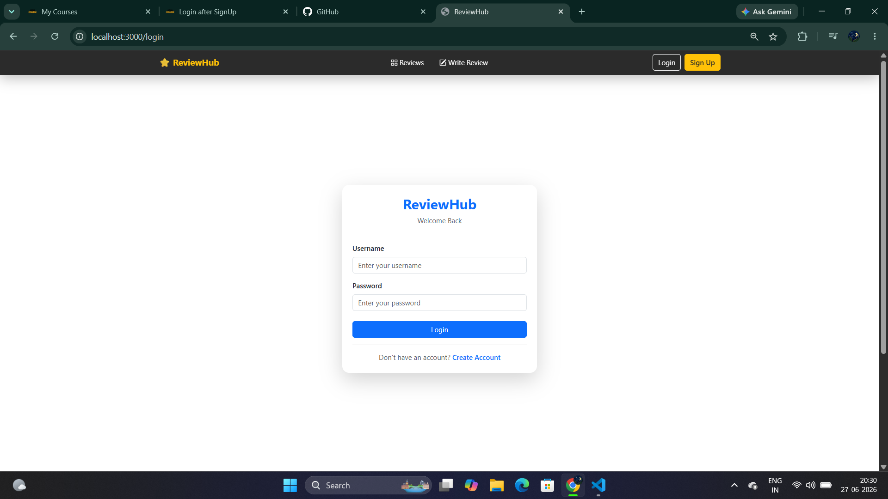
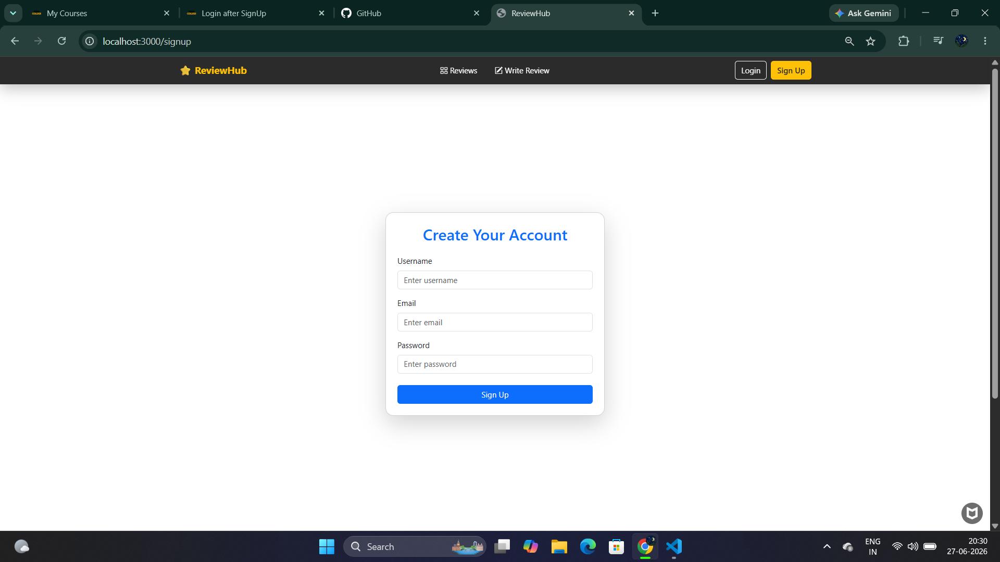
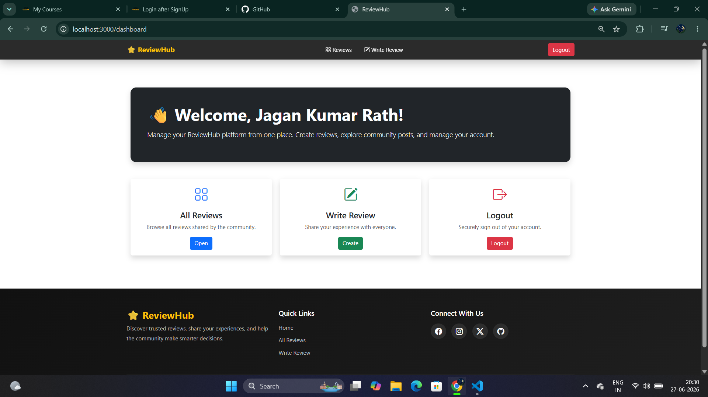
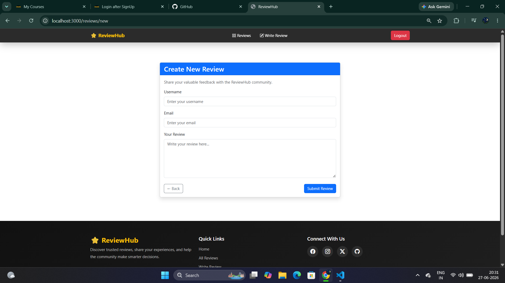
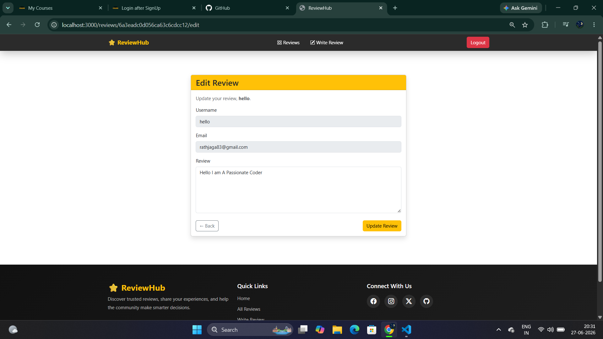

# ReviewHub

A full-stack MERN Review Management application where users can securely sign up, log in, and manage reviews. Built with Node.js, Express.js, MongoDB, Passport.js, EJS, and Bootstrap following the MVC architecture.

---

## 🚀 Features

- 🔐 User Authentication (Passport.js)
- 👤 User Registration & Login
- ⭐ Create, Read, Update & Delete Reviews (CRUD)
- 💬 Flash Messages
- 🛡️ Session-Based Authentication
- ✅ Input Validation
- 📱 Responsive Bootstrap UI
- 🏗️ MVC Architecture

---

## 🛠️ Tech Stack

- Node.js
- Express.js
- MongoDB
- Mongoose
- Passport.js
- Express Session
- EJS
- Bootstrap 5

---

## 📂 Project Structure

```text
ReviewHub/
├── controllers/
├── middleware/
├── models/
├── public/
│   ├── css/
│   └── js/
├── routes/
├── views/
├── screenshots/
├── app.js
├── package.json
└── README.md
```

---

## ⚙️ Installation

Clone the repository

```bash
git clone https://github.com/your-username/reviewhub.git
```

Move into the project directory

```bash
cd reviewhub
```

Install dependencies

```bash
npm install
```

Create a `.env` file

```env
MONGO_URI=your_mongodb_connection_string
SESSION_SECRET=your_secret_key
```

Start the application

```bash
npm start
```

---

## 📸 Screenshots

### Home Page


### Login Page


### Signup Page


### Dashboard


### Create Review


### Edit Review


## 🔮 Future Enhancements

- Image Upload
- Search & Filter Reviews
- Pagination
- User Profiles
- Admin Dashboard

---

## 👨‍💻 Author

**Jagan Kumar Rath**

If you found this project helpful, don't forget to ⭐ the repository.
